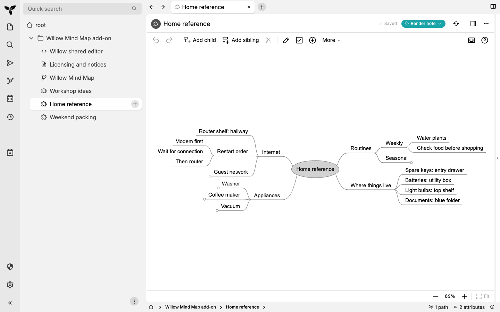

# Willow for Trilium

**Compact, keyboard-driven mind maps for thinking, reference notes and everyday lists.**

Willow is a notepad with room to branch. Add ideas without arranging a canvas,
move a whole branch as your thinking changes, and fold details while keeping the
surrounding structure in view.

**Requires [Trilium Notes](https://triliumnotes.org/).** Install Willow inside your
own Trilium instance. Use its desktop app or access your Trilium server in a browser;
there is no separate Willow account. Windows and macOS are supported.
[Compatibility and evidence](docs/compatibility.md) · [MIT license](LICENSE)

## Three ways to use it

| Thinking | Reference | Doing |
| --- | --- | --- |
| Brainstorm a workshop, group related ideas and reorder branches. | Keep a household guide close at hand; expand details when you need them. | Pack for a weekend and check off the last things before leaving. |
| [Workshop ideas](docs/examples.md#thinking-workshop-ideas) | [Home reference](docs/examples.md#reference-home-reference) | [Weekend packing](docs/examples.md#doing-weekend-packing) |

[Watch the workflow](docs/demo.md): enter an idea, nest a detail, move it, fold a
branch, check an item, then leave and return to the saved map. A screenshot and
text walkthrough are included alongside the recording.

The screenshots and recording use the current source build on Trilium 0.105.0.
The three richer examples are included in this source build and prepared for the
next release; published v0.2.1 contains the smaller **Example mind map** sample.

## Install and make a map

1. Set up [Trilium](https://docs.triliumnotes.org/user-guide/setup) first.
2. From [Willow Releases](https://github.com/optifunc/trilium-willow/releases/latest),
   download the `trilium-willow-<version>.zip` asset. For v0.2.1, this is
   `trilium-willow-0.2.1+build.7.1.zip`. GitHub's **Source code** archives are for development.
3. In Trilium's note tree, choose **Import into note**, select that ZIP, and retain
   **Safe import**. Open **Willow Mind Map** and each example you want to use;
   click **Enable render note** on each.
4. Outside the imported add-on subtree, right-click a note and choose **Insert
   child note → Templates → Willow Mind Map**. Name it in Trilium's title field.
5. Click the map, press **Tab** to add a child, type a label and press **Enter**.
   **Enter** on a selected node adds a sibling; **F2** edits; **Space** folds a branch.
   Wait for Trilium's **Saved** indicator, then navigate away and return.

Open **Keyboard shortcuts** in the toolbar or **More** for the complete reference.
For checkbox items, **Ctrl+Space** toggles the check on both Windows and macOS.

[Installation, update and recovery](docs/installation.html) ·
[Everyday use](docs/usage.md) · [Build from source](docs/testing.md)

Already installed? Update the existing shared editor as described in the guide.
Importing another ZIP creates another installation; it does not upgrade your maps.

## Why Willow when Trilium has mind maps?

Willow emphasizes compact labels, automatic two-sided layout, branch folding,
checkboxes and keyboard restructuring. Its examples let you judge whether that
combination suits your notes.

Trilium's built-in **Mind Map** also supports keyboard creation and movement,
and provides formatting and SVG/PNG export. [Compare the same hierarchy in both
editors](docs/comparison.md). Note/Tree/Link Maps visualize existing Trilium notes;
Willow keeps each map's hierarchy inside one note.

## Boundaries and help

- A map is one Trilium note; its nodes are not separate notes or a native task database.
- Sync, self-hosting and protected notes are Trilium features available to Willow.
  Protection applies to the whole note. Sync is not concurrent collaborative editing;
  competing saved versions can overwrite one another, and unsaved drafts live in memory.
- FreeMind file import, internal note links, dedicated image/document export and
  touch interaction are not available. HTTP(S) URL labels and outline clipboard
  copying/pasting are available.

Coming from FreeMind? [Read the migration background and current limits](docs/audiences.md#coming-from-freemind).
New to Trilium? [Start with the prerequisite](docs/audiences.md#new-to-trilium).

Report problems in [GitHub Issues](https://github.com/optifunc/trilium-willow/issues).
Include Willow/Trilium versions, OS, client/browser, steps to reproduce and the
visible error. Use synthetic examples instead of personal note contents.

## Development

[Contributor setup and checks](docs/testing.md) · [Architecture and development](docs/development.md) ·
[Builds and releases](docs/github-actions.md) · [Progress and evidence](docs/progress.md) ·
[Widget source](mr/README.md) · [Licensing and notices](docs/licensing.md)
