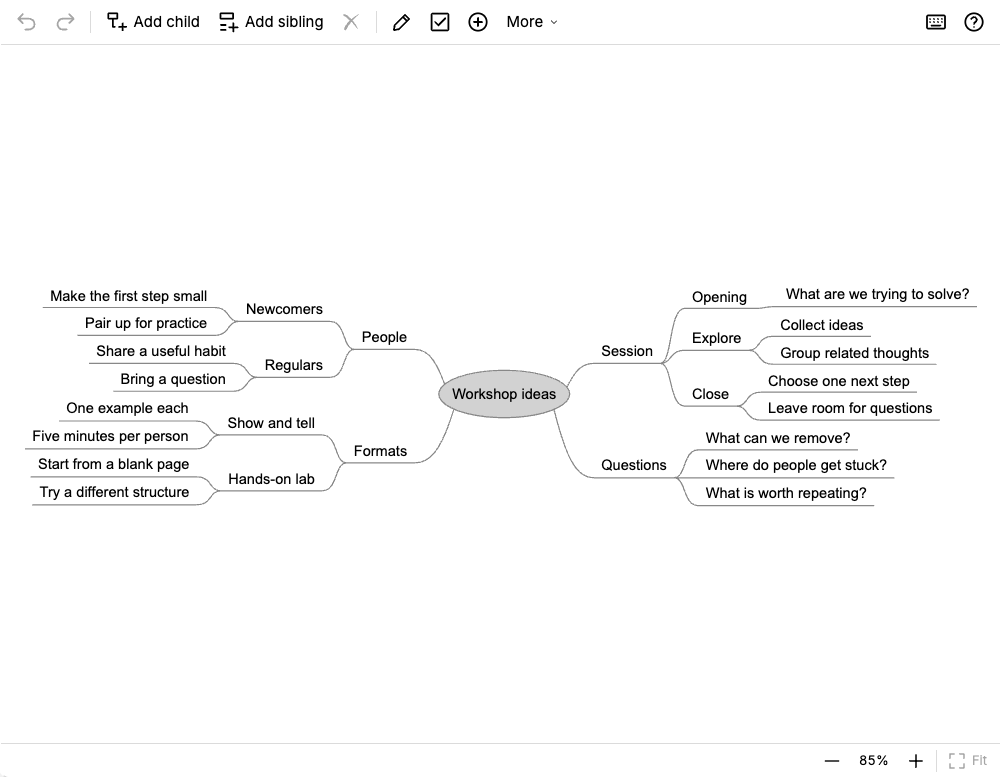
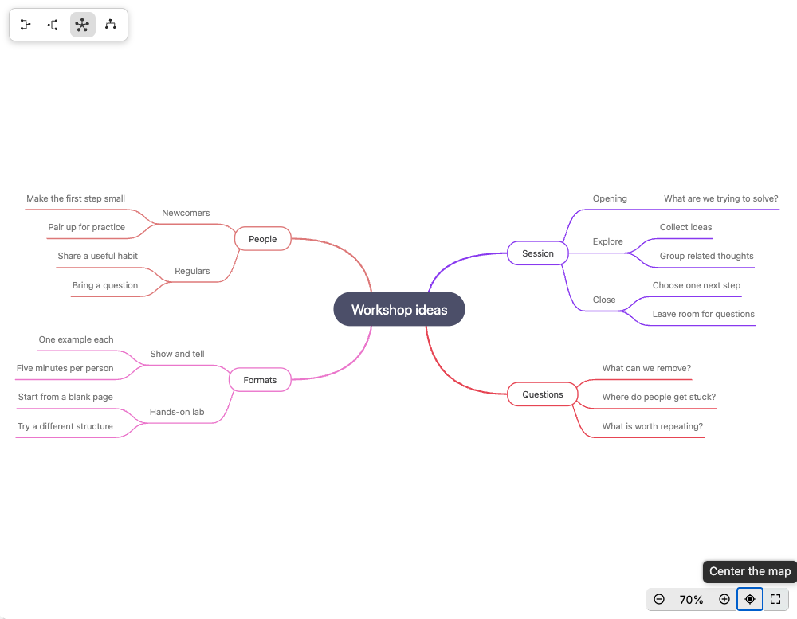

# Willow and Trilium's native maps

Choose Willow if compact labels, branch folding, checkboxes and keyboard
restructuring suit the notes you revisit. Trilium's built-in Mind Map may already
meet your needs, particularly when presentation styling or image export matters.

| Need | Willow | Native Trilium Mind Map |
| --- | --- | --- |
| Create a hierarchy with the keyboard | Child/sibling creation and editing | Child/sibling/parent creation |
| Restructure and hide detail | Keyboard branch movement and folding | Keyboard movement and folding |
| Keep checks beside short notes | Node checkboxes | Try the native editor against your checklist needs |
| Change presentation | Automatic layout and compact labels | Formatting panel and styling controls |
| Share an image | No dedicated image export | SVG and PNG export |

Native capabilities are described in the [official Mind Map guide](https://docs.triliumnotes.org/user-guide/note-types/mindmap).
This comparison covers the workflows shown here, rather than every feature or customization.

## The same workshop in both editors

Both captures contain the same **28 nodes**, text, hierarchy, sibling order and
left/right branch assignment from [Workshop ideas](examples.md#thinking-workshop-ideas).
All branches are expanded. Both use the same note pane, approximately **1000 × 777
pixels**, in the same Trilium 0.105.0 browser session.

### Willow

Willow uses its default presentation and **Fit** command (85% displayed zoom).

### Native Mind Map

Native Mind Map uses its default **Latte** theme, compact mode off, and a two-sided
layout. Its **Center the map** and **Zoom out** controls bring all labels into the
pane (70% displayed zoom). No fonts, spacing or colors were overridden for either
capture. Zoom percentages are editor-specific, so they are not a density metric.
Native themes, styling and compact mode can change its appearance; this shows one
default presentation, not the limits of what it can do.

The point to judge is how easily you can read and revisit this particular map.
[Try the keyboard workflow](demo.md) as well as looking at the screenshots.

## Other Trilium views

- [Note, Tree and Link Maps](https://docs.triliumnotes.org/user-guide/advanced-usage/note-map)
  visualize existing notes and their relationships. Willow's nodes are content
  inside one note, not separate Trilium notes.
- [Relation Maps](https://docs.triliumnotes.org/user-guide/note-types/relation-map)
  arrange existing notes and relationships spatially.
- [Canvas](https://docs.triliumnotes.org/user-guide/note-types/canvas) offers a
  freeform drawing surface through Excalidraw.

Trilium provides the containing knowledge base, desktop/browser access, sync and
note protection. Those are shared host benefits, not exclusive Willow features.

[Capture settings, data and verification](evidence/a2/report.md)
