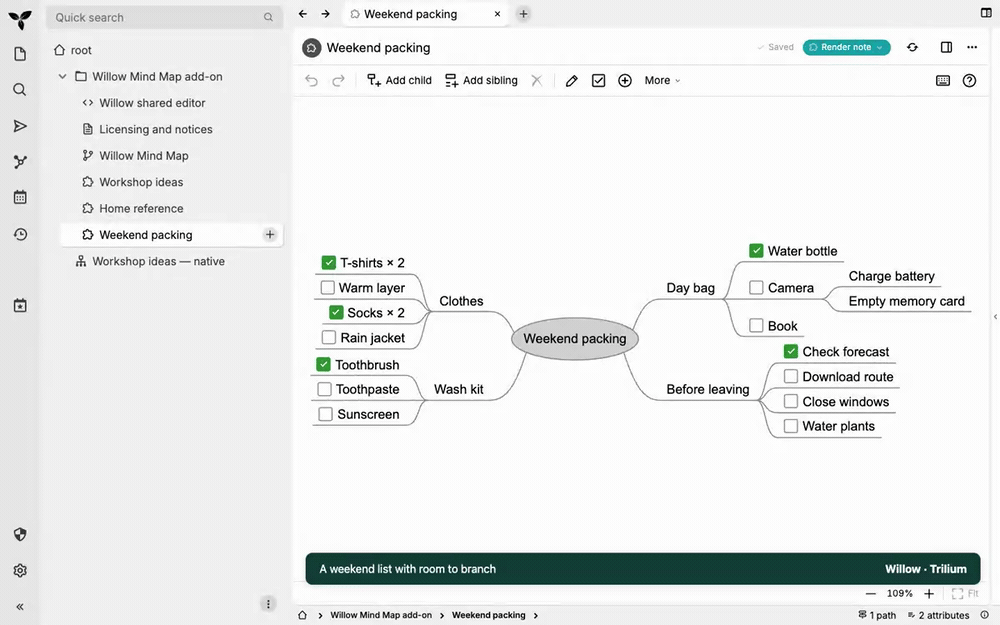
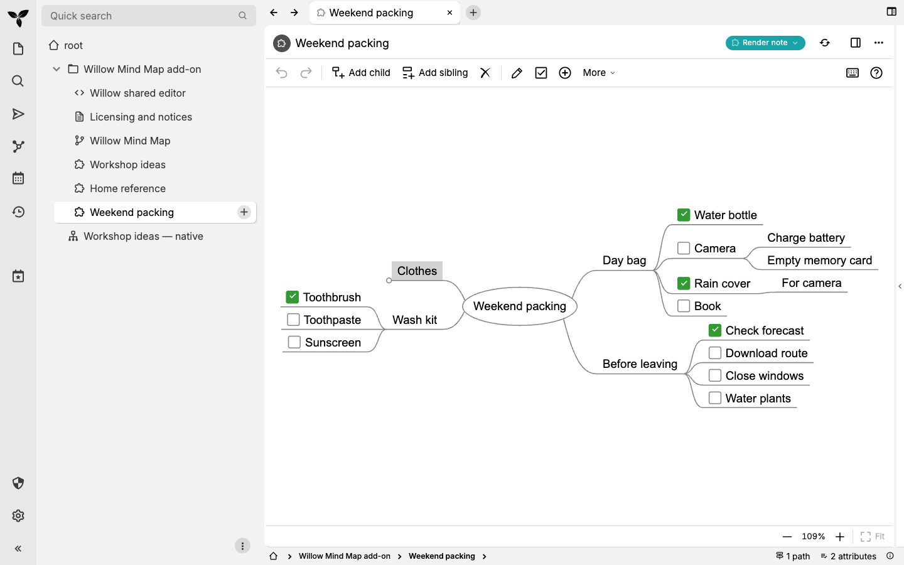

# A list with room to branch

In about 33 seconds, this recording turns a packing idea into a checked item,
keeps a detail attached while moving the branch, folds a branch, and returns
to the saved map after consulting a reference.

[Play or download the MP4](media/workflow.mp4). Both versions show the actual Willow
source build inside Trilium 0.105.0 on macOS, using synthetic content. Captions
identify the actions and shortcuts. The recording has no audio.

## Try the steps

Start with **Weekend packing** from the [three examples](examples.md). Click a
label to select it, then use these keys:

| Action | macOS | Windows |
| --- | --- | --- |
| Select **Day bag**, add **Rain cover**, finish its label | Tab, type, Enter | Tab, type, Enter |
| Nest **For camera** under Rain cover | Tab, type, Enter | Tab, type, Enter |
| Select **Rain cover** and move the whole branch above **Book** | Cmd+Up | Ctrl+Up |
| Add a checkbox to Rain cover | Cmd+1 | Ctrl+1 |
| Check Rain cover | Ctrl+Space | Ctrl+Space |
| Select **Clothes** and fold its details | Space | Space |
| Open **Home reference** in Trilium's note tree | Click | Click |
| Select **Washer** and expand its reminders | Space | Space |
| Return to **Weekend packing** in the note tree | Click | Click |

Wait for **Saved** before leaving. When you return, Rain cover is checked, its
For camera detail remains attached, and Clothes stays folded.

Windows and macOS are supported; this recording was made on macOS. The current
source package includes these examples; published v0.2.1 has the earlier smaller
sample. [Build the source](testing.md) to try these exact maps before the next
release, or use the same actions on your own map. Create personal maps outside
the imported installation using **Templates → Willow Mind Map**.

[Capture method and verification](evidence/a2/report.md) · [Keyboard reference](usage.md)
