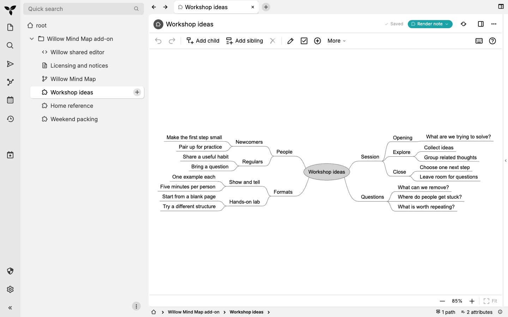
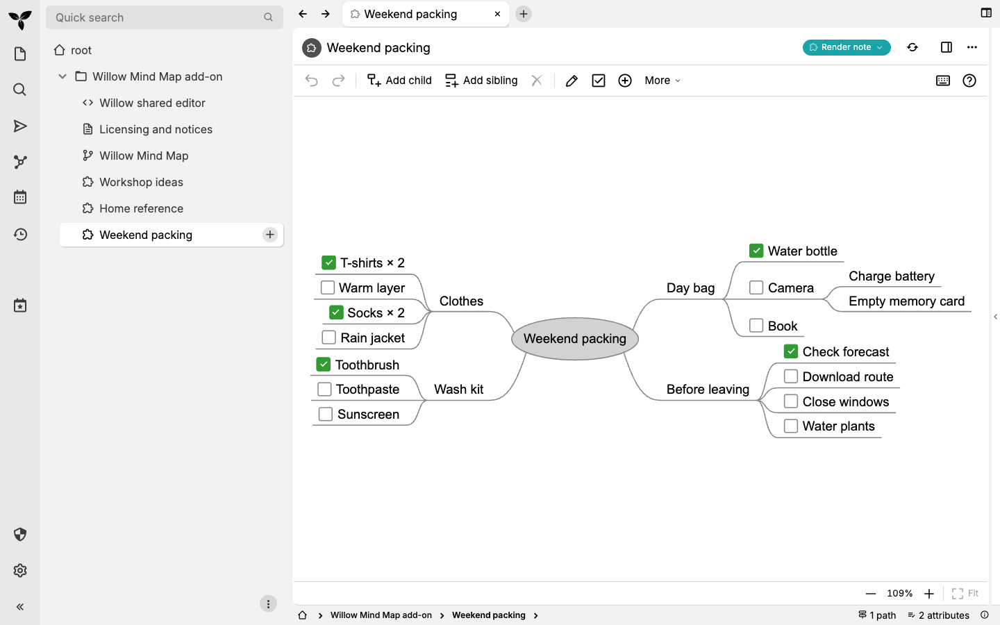

# Three examples to try

Willow suits short ideas you want to see together, with room to expand. These
synthetic maps ship in the current source build. Published v0.2.1 still contains
the earlier small **Example mind map**; the three examples are prepared for the
next release. [Build the current source](testing.md), or use these screenshots
and descriptions to explore the workflow first.

## Thinking: Workshop ideas

Start with people, possible formats, a session outline and unanswered questions.
Keep alternatives side by side, then move branches when the structure becomes
clearer. This example is deliberately a brainstorm rather than a list of tasks.

Try adding a possibility under **Formats**, nesting a detail with Tab, and moving
it within its siblings using Cmd+Up/Down on macOS or Ctrl+Up/Down on Windows.

## Reference: Home reference

Frequently used facts stay visible: where spare keys live, where to find batteries,
and the router's location. Washer, coffee maker and vacuum details begin folded,
so occasional information stays close without taking over the map.

Select **Washer** and press Space to see the maintenance reminders; press it again
to fold them. These are illustrative facts, not instructions for your appliances.
You can protect a whole reference note through Trilium; protection is not per node.

## Doing: Weekend packing

Clothes and toiletries sit beside the day bag and last-minute errands. A checkbox
belongs to a map node; it does not create a task elsewhere in Trilium.

Select **Rain jacket** and press Ctrl+Space to toggle its check. The same shortcut
works on macOS. To add or remove the checkbox itself, use Cmd+1 on macOS or Ctrl+1
on Windows. Fold a finished branch with Space to make room for what remains.

[Watch this map being edited](demo.md). Create personal maps from **Templates →
Willow Mind Map** outside the imported installation, so examples and personal
content have separate homes.

## Canonical source

[examples/maps.json](../examples/maps.json) supplies the package and all three
captures. Note titles match root labels so title synchronization does not rename
the examples on first opening. The native comparison converts the workshop's same
text, hierarchy and sibling order into the native editor's format for a fixture;
it is not a user-facing import feature. [Capture and verification details](evidence/a2/report.md).
